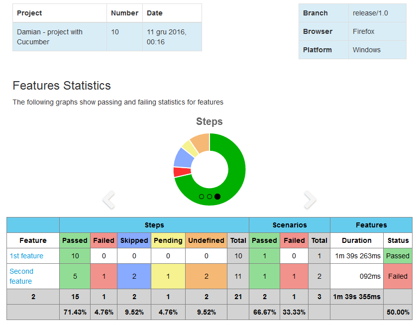

# demo-playwright-behave
A tiny but working example e2e test suite using [Playwright]/Python with [behave] interpreting a [Gherkin] feature file.

Output is a video file and a summary on the console:
```
1 feature passed, 0 failed, 0 skipped
1 scenario passed, 0 failed, 0 skipped
2 steps passed, 0 failed, 0 skipped, 0 undefined
Took 0m0.840s
```

Additionally, if you use [Jenkins](https://www.jenkins.io/) and the [cucumber-reports-plugin](https://github.com/jenkinsci/cucumber-reports-plugin)
is installed, a green "Cucumber reports" button should appear in the Classical Jenkins UI, showing a report like:



# Example video file

[doc/00001__passed__end_to_end.feature__Website_is_working.webm](doc/00001__passed__end_to_end.feature__Website_is_working.webm)

# Quick start

```bash
$ ./build.py --help
usage: build.py [-h] [--wip] [--interactive] [--overlay OVERLAY]

Build and run Docker container for Playwright E2E tests.

options:
  -h, --help         show this help message and exit
  --wip              Run only scenarios with attribute @wip
  --interactive      Show the browser and allow interacting with Python breakpoints
  --overlay OVERLAY  Show Given/When/Then steps as text overlay on the page and in videos for the specified number of seconds

$ ./build.py
Building image: playwright-e2e-local
+ rm -rf build/context
+ mkdir -p build/context
+ cp -r test build/context
+ docker build build/context -f build/context/test/Dockerfile --tag playwright-e2e-local
[+] Building 0.2s (10/10) FINISHED                                                                                                                                 docker:default
 => [internal] load build definition from Dockerfile                                                                                                                         0.0s
 => => transferring dockerfile: 266B                                                                                                                                         0.0s
 => [internal] load metadata for mcr.microsoft.com/playwright/python:v1.48.0-noble                                                                                           0.0s
 => [internal] load .dockerignore                                                                                                                                            0.0s
 => => transferring context: 2B                                                                                                                                              0.0s
 => [1/5] FROM mcr.microsoft.com/playwright/python:v1.48.0-noble                                                                                                             0.0s
 => [internal] load build context                                                                                                                                            0.0s
 => => transferring context: 18.23kB                                                                                                                                         0.0s
 => CACHED [2/5] RUN pip install --no-cache-dir playwright==1.48.0 behave==1.2.6                                                                                             0.0s
 => CACHED [3/5] RUN playwright install chromium                                                                                                                             0.0s
 => CACHED [4/5] RUN mkdir -p /build /videos                                                                                                                                 0.0s
 => CACHED [5/5] COPY . /                                                                                                                                                    0.0s
 => exporting to image                                                                                                                                                       0.0s
 => => exporting layers                                                                                                                                                      0.0s
 => => writing image sha256:1ad0a715054a9dbd2ffbdf447eb9c6a4392b8ece83df04145136e3ac147a0dd3                                                                                 0.0s
 => => naming to docker.io/library/playwright-e2e-local                                                                                                                      0.0s
Recreating and running container: playwright-e2e
+ docker container rm -f playwright-e2e 2>/dev/null
+ docker run --network=host -t --name playwright-e2e  playwright-e2e-local
+ eval 'xvfb-run behave test --tags ~@skip --no-skipped --no-capture --format pretty'
++ xvfb-run behave test --tags '~@skip' --no-skipped --no-capture --format pretty
Feature: End to end # test/features/end_to_end.feature:1
  As a developer,
  I want to make sure that my website passes a basic e2e smoke test.
  Scenario: Website is working                                                                        # test/features/end_to_end.feature:6
    When I open the url https://playwright.dev                                                        # test/steps/e2e.py:5 0.488s
    Then "Playwright enables reliable end-to-end testing for modern web apps." is visible on the page # test/steps/e2e.py:10 0.055s

1 feature passed, 0 failed, 0 skipped
1 scenario passed, 0 failed, 0 skipped
2 steps passed, 0 failed, 0 skipped, 0 undefined
Took 0m0.543s
Copying test artifacts...
+ docker cp playwright-e2e:/videos build
Successfully copied 34.8kB to /home/vitaliy/git/github/thinkingerrol/demo-playwright-behave/build
+ docker cp playwright-e2e:/build .
Successfully copied 2.56kB to /home/vitaliy/git/github/thinkingerrol/demo-playwright-behave/.
Removing container...
+ docker container rm playwright-e2e
playwright-e2e
```

# Integration into CI systems

If you use Jenkins, the Jenkinsfile might look like this:

```Jenkinsfile
try {
  sh './build.py'
}
finally {
  archiveArtifacts 'build/**/*'
  stage('Generate HTML report') {
      cucumber reportTitle: 'Test report',
               fileIncludePattern: '**/*.json',
  }
}
```

in the Build Artifacts you should then see files like:
```
* 00001__passed__end_to_end.feature__Website_is_working.webm

or:
* 00001__failed__end_to_end.feature__Website_is_working.webm
```

[behave]: https://behave.readthedocs.io
[Dockerfile]: test/Dockerfile
[Gherkin]: https://stackoverflow.com/questions/6221742/where-can-i-find-a-gherkin-language-spec-guide
[Playwright]: https://playwright.dev
